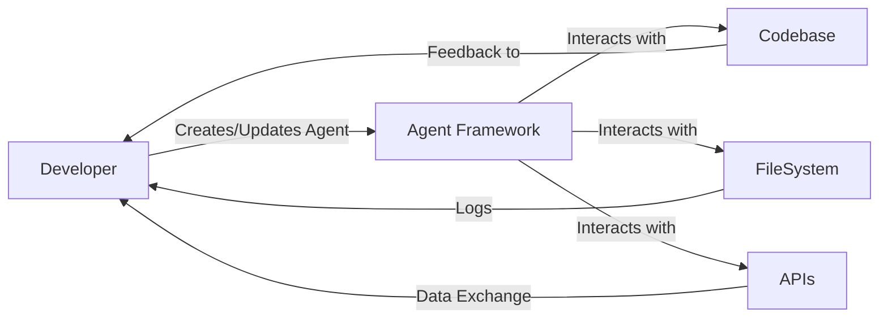

Creating a raw content outline for a new 'agents' section in a GitHub project can be much about balancing thorough documentation with readability and utility. Here is an example of how such a section might be structured in Markdown, with proposed next steps. This will assume a file structure and naming convention that fits in with the existing project:

# Agents

## Overview 🌐

Agents are autonomous or semi-autonomous entities within the 'undecidability' project that interact with code, data, and other systems to perform tasks, run trials, and aid in development.

## Types of Agents 🤖

- **Vision Agent**: Converts images to code snippets, creates diagrams, and assists with screen recordings.
- **Trial Agent**: Engages in verification and code challenges, conducting trials and compiling reports on outcomes.
- **Git Agent**: Manages version control integration, automates commit messages, and monitors repository health.
- **Chatbot Agent**: Assists developers with queries and provides information on demand using natural language processing.

## Key Features 🗝️

- Automated workflow integration
- Self-monitoring capabilities
- API connectivity for enhanced functionality
- Limited filesystem access to ensure security

## Next Steps 🛤️

1. Develop a framework for each type of agent to operate within.
2. Implement a prototype for a single agent, likely the Vision Agent, due to its straightforward application.
3. Set up a logging system to allow agents to report activities and outcomes.
4. Create a security model that defines what each agent can and cannot do within the system.
5. Establish communication protocols between agents and other parts of the system.

## Documentation Standards 📚

Agents documentation should be written in a clear and consistent manner. Use mermaid diagrams and other advanced markdown features to illustrate complex relations and workflows.

Document each new feature and change comprehensively, tracking changes through the Git Agent.

### Using Icons for Clarity 🌟

- Utilize icons to visually categorize sections and features for quick reference and a cleaner look.

## Testing and Trials 🔬

Detail methodologies for testing each agent's functionality and performance. Use continuous integration pipelines to automate testing processes.

## Budget and Cost Tracking 💰

- Include a section for tracking development costs and operational budgets per agent using the Chatbot Agent for reporting and alerts.

## Code Generation and API Integration 🛠️

- Prioritize the development of agents that can generate code and connect to APIs to expand their capabilities.