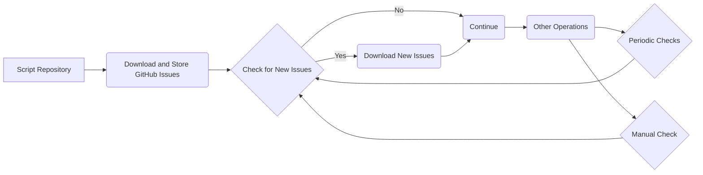

# Script to Download and Store GitHub Issues

This script allows you to download all GitHub issues for your repository and store them in memory for fast access. It uses the GitHub CLI (gh) or GitHub API to retrieve as much information as available about the issues.

## Prerequisites

- GitHub CLI (gh) installed and authenticated with your GitHub account.

## Instructions

1. Clone or download the script repository.
2. Install the required dependencies.
3. Run the script by executing the main file.

## Usage

`python main.py [--refresh]`

- The `--refresh` flag initiates a check for new issues, downloading any that are found.

## Additional Features

- Supports periodic checks for new issues.
- Option to manually trigger a check for new issues.
- Option to specify the repository where issues should be downloaded from.

## Next Steps

- Consider integrating the script into a larger workflow or automation system.
- Explore additional GitHub API features for more advanced issue management.
- Build a front-end interface for easier issue access and management.

## Related Projects

- [GitHub CLI (gh)](https://github.com/cli/cli) - Official GitHub command-line tool.
- [GitHub API](https://docs.github.com/en/rest) - Official API documentation for interacting with GitHub.
- [GitHub Actions](https://github.com/features/actions) - Automate your workflow directly from GitHub.

::: tip
For best results, ensure the gh CLI and other dependencies are up to date.
:::

::: details Read More
For more details about the script and its implementation, refer to the [script repository](https://github.com/your-repo).
:::

```stl
solid GitHub_Issues
  facet normal 0 0 0
    outer loop
      vertex 0 0 0
      vertex 0 0 1
      vertex 1 0 1
    endloop
  endfacet
  facet normal 0 1 0
    outer loop
      vertex 1 1 1
      vertex 0 1 1
      vertex 0 1 0
    endloop
  endfacet
  facet normal 1 0 0
    outer loop
      vertex 1 0 0
      vertex 1 0 1
      vertex 1 1 1
      vertex 1 1 0
    endloop
  endfacet
  facet normal 0 -1 0
    outer loop
      vertex 1 0 0
      vertex 0 0 0
      vertex 0 0 1
      vertex 1 0 1
    endloop
  endfacet
  facet normal 0 0 -1
    outer loop
      vertex 1 1 0
      vertex 0 1 0
      vertex 0 0 0
      vertex 1 0 0
    endloop
  endfacet
  facet normal 0 0 1
    outer loop
      vertex 1 0 1
      vertex 0 0 1
      vertex 0 1 1
      vertex 1 1 1
    endloop
  endfacet
endsolid
```



## Conclusion

With this script, you can easily download and store GitHub issues for your repository, enabling fast access to issue information. You can also periodically check for new issues and manually trigger checks as needed. Enjoy efficient issue management in your GitHub workflow!
