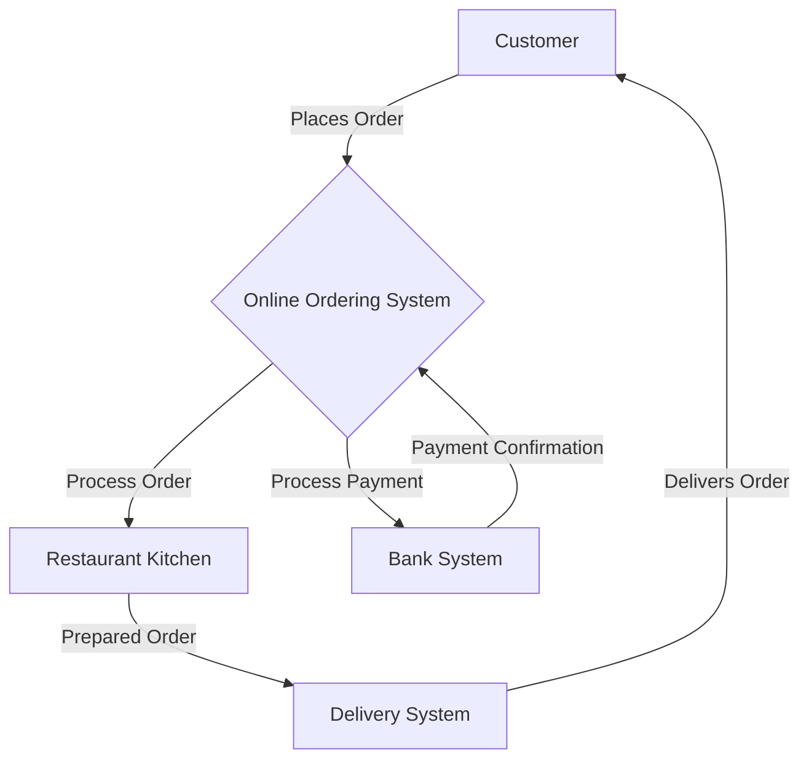

**Prompt:**
Create an example data flow diagram (DFD) in mermain for markdown

**Response:**
You can represent a data flow diagram (DFD) in Mermaid syntax within a Markdown document. Below is an example of how to represent a simple data flow diagram for a restaurant's online ordering system:



This simply shows a customer placing an order through an online system, which then processes the order and forwards it to the kitchen. At the same time, the payment is processed through the bank. Once the kitchen has prepared the order, it goes to the delivery system, which then delivers the order to the customer.

<details><summary>Metadata</summary>

- Duration: 17825 ms
- Datetime: 2023-10-20T10:38:20.860851
- Model: gpt-4-0613

</details>

**Options:**
```json
{}
```

