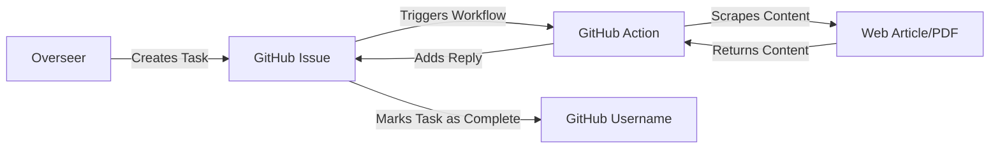

**Prompt:**
An automation scheme utilizing a private GitHub repo for task management through issues, serving as a human-to-GitHub Actions interface.  

- The primary user of this system is the human Overseer, who orchestrates the Augmented Intelligence system.

Functional Requirements:

1. The system should be coded in Python, making use of GitHub Action workflows.
2. The primary user will be a human overseer who interacts with the system through a Text User Interface (TUI).
3. The TUI should allow the browsing of issues labeled 'overseer-inbox'.
4. The TUI should provide functions for adding new tasks and replying to queries.
5. The new tasks should be submitted in the form of GitHub issues, following a set task format and labeled as inbox-url.
6. A workflow action should be triggered when an issue is labeled as an inbox-url.
7. If an inbox-url task is incomplete or contains an invalid URL, the system should flag an error and add a helpful error message to the task issue.
8. The system should be able to scrape textual content from web articles and PDF documents found through the task's URL.
9. The results of the web or PDF scraping should be added as a reply in the respective GitHub issue, marked by.
10. Upon completion of content retrieval, the system should mark the task as complete.
11. After task completion, the issue is to be assigned to a provided GitHub username.

Non-Functional Requirements:

1. The system should efficiently and accurately scrape content from web articles and PDFs, primarily targeting articles.
2. The system should handle errors gracefully. Any error that occurs during the task execution should be logged as a reply to the task issue for review.
3. The system should be capable of handling multiple tasks simultaneously, managing task status and information through GitHub issues and GitHub Repo artifacts, ensuring no data loss.
4. The system should be secure, minimizing exposure to potential security risks during actions such as web scraping and issue management.
5. The system should provide clear and understandable notifications, especially during error conditions to facilitate troubleshooting and debugging.
6. The system should be maintainable and scalable, allowing for easy addition of new features and capabilities.


Sketch an outline for the system design using markdown mermaid diagrams. Then define the associated tasks for development.

**Response:**
## System Design Outline



## Associated Tasks for Development

1. **Task 1:** Set up a private GitHub repo and configure GitHub Actions.
2. **Task 2:** Design and implement the Text User Interface (TUI) for the overseer. This includes functions for browsing issues, adding new tasks, and replying to queries.
3. **Task 3:** Implement the functionality to create new tasks as GitHub issues from the TUI, following a set task format and labeling them as inbox-url.
4. **Task 4:** Implement a GitHub Action workflow that is triggered when an issue is labeled as an inbox-url.
5. **Task 5:** Implement error handling for incomplete or invalid inbox-url tasks. The system should flag an error and add a helpful error message to the task issue.
6. **Task 6:** Implement functionality to scrape textual content from web articles and PDF documents found through the task's URL.
7. **Task 7:** Implement functionality to add the results of the web or PDF scraping as a reply in the respective GitHub issue.
8. **Task 8:** Implement functionality to mark the task as complete upon completion of content retrieval.
9. **Task 9:** Implement functionality to assign the completed issue to a provided GitHub username.
10. **Task 10:** Implement efficient and accurate web and PDF scraping, primarily targeting articles.
11. **Task 11:** Implement error logging. Any error that occurs during the task execution should be logged as a reply to the task issue for review.
12. **Task 12:** Implement functionality to handle multiple tasks simultaneously, managing task status and information through GitHub issues and GitHub Repo artifacts.
13. **Task 13:** Implement security measures to minimize exposure to potential security risks during actions such as web scraping and issue management.
14. **Task 14:** Implement clear and understandable notifications, especially during error conditions.
15. **Task 15:** Ensure the system is maintainable and scalable, allowing for easy addition of new features and capabilities.

<details><summary>Metadata</summary>

- Duration: 37352 ms
- Datetime: 2023-10-29T14:24:35.397279
- Model: gpt-4-0613

</details>

**Options:**
```json
{"temperature": 0.4}
```

**Prompt:**
Task 1: Done: https://github.com/irthomasthomas/private-notes.
Tasks 2,3 and 4 will be carried out by Joseph. Write the instructions to Joseph. Proceed with the same.

**Response:**
Dear Joseph,

Please find below the instructions for tasks 2, 3, and 4 for our automation scheme project. 

**Task 2 - Implement Text User Interface (TUI):**

1. Design an interface where users can browse through issues labeled as 'overseer-inbox'. This could be a simple list interface in the command line.
2. Within the TUI, also implement functions to add new issues/tasks and reply to queries. Input for the task could be a simple string, while the query replies could involve choosing options or entering detailed text.
3. Make sure the TUI is user-friendly with clear instructions and readable text.

**Task 3 - Implement GitHub Issue Creation From TUI:**

1. When a user adds a new task through the TUI, translate this into a new GitHub issue in our private repository.
2. Follow a set task format for issue creation. This could include details like date and time of creation, task description, creator, and other relevant details.
3. Label these issues as 'inbox-url'. 

**Task 4 - Implement GitHub Action Workflow:**

1. Design and implement a GitHub Actions workflow that is triggered when an issue labeled as 'inbox-url' is created.
2. The workflow should be configured to perform further tasks such as web scraping, replying to the issue with scraped information, marking the task as complete, etc. Currently, just the triggering of the workflow based on the condition of issue labelling is required.
   
Remember to commit and push your code consistently so all changes are tracked. Also, test thoroughly after each task before moving to the next one. Let me know if you encounter any issues. 

Best, 
[Your Name]

<details><summary>Metadata</summary>

- Duration: 29575 ms
- Datetime: 2023-10-29T14:50:57.270162
- Model: gpt-4-0613

</details>

**Options:**
```json
{}
```

