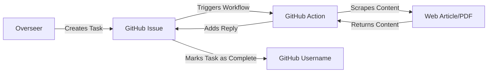

**Prompt:**
Begin writing code and unit tests. Use click for the tui. And apply sensible abstractions where beneficial.

## System Design Outline



## Associated Tasks for Development

1. **Task 1:** Set up a private GitHub repo and configure GitHub Actions.
2. **Task 2:** Design and implement the Text User Interface (TUI) for the overseer. This includes functions for browsing issues, adding new tasks, and replying to queries.
3. **Task 3:** Implement the functionality to create new tasks as GitHub issues from the TUI, following a set task format and labeling them as inbox-url.
4. **Task 4:** Implement a GitHub Action workflow that is triggered when an issue is labeled as an inbox-url.
5. **Task 5:** Implement error handling for incomplete or invalid inbox-url tasks. The system should flag an error and add a helpful error message to the task issue.
6. **Task 6:** Implement functionality to scrape textual content from web articles and PDF documents found through the task's URL.
7. **Task 7:** Implement functionality to add the results of the web or PDF scraping as a reply in the respective GitHub issue.
8. **Task 8:** Implement functionality to mark the task as complete upon completion of content retrieval.
9. **Task 9:** Implement functionality to assign the completed issue to a provided GitHub username.
10. **Task 10:** Implement efficient and accurate web and PDF scraping, primarily targeting articles.
11. **Task 11:** Implement error logging. Any error that occurs during the task execution should be logged as a reply to the task issue for review.
12. **Task 12:** Implement functionality to handle multiple tasks simultaneously, managing task status and information through GitHub issues and GitHub Repo artifacts.
13. **Task 13:** Implement security measures to minimize exposure to potential security risks during actions such as web scraping and issue management.
14. **Task 14:** Implement clear and understandable notifications, especially during error conditions.
15. **Task 15:** Ensure the system is maintainable and scalable, allowing for easy addition of new features and capabilities.

**Response:**
## Code

```python
import click
from github import Github

# Initialize GitHub API
g = Github("<access_token>")

# Get the repository
repo = g.get_repo("<username>/<repo_name>")

@click.group()
def cli():
    pass

@click.command()
@click.argument('title')
@click.argument('body')
def create_issue(title, body):
    """
    Create a new GitHub issue
    """
    issue = repo.create_issue(
        title=title,
        body=body,
        labels=[
            repo.get_label("inbox-url")
        ]
    )
    click.echo(f"Issue created with ID: {issue.number}")

@click.command()
@click.argument('issue_id')
def mark_complete(issue_id):
    """
    Mark a GitHub issue as complete
    """
    issue = repo.get_issue(number=int(issue_id))
    issue.edit(state='closed')
    click.echo(f"Issue {issue_id} marked as complete")

cli.add_command(create_issue)
cli.add_command(mark_complete)

if __name__ == '__main__':
    cli()
```

## Unit Tests

```python
import unittest
from unittest.mock import patch, MagicMock
from click.testing import CliRunner
import overseer

class TestOverseer(unittest.TestCase):
    def setUp(self):
        self.runner = CliRunner()

    @patch('overseer.Github')
    def test_create_issue(self, mock_github):
        mock_issue = MagicMock()
        mock_issue.number = 123
        mock_repo = MagicMock()
        mock_repo.create_issue.return_value = mock_issue
        mock_github.return_value.get_repo.return_value = mock_repo

        result = self.runner.invoke(overseer.create_issue, ['Test Issue', 'Test Body'])

        self.assertEqual(result.exit_code, 0)
        self.assertIn('Issue created with ID: 123', result.output)

    @patch('overseer.Github')
    def test_mark_complete(self, mock_github):
        mock_issue = MagicMock()
        mock_repo = MagicMock()
        mock_repo.get_issue.return_value = mock_issue
        mock_github.return_value.get_repo.return_value = mock_repo

        result = self.runner.invoke(overseer.mark_complete, ['123'])

        self.assertEqual(result.exit_code, 0)
        self.assertIn('Issue 123 marked as complete', result.output)

if __name__ == '__main__':
    unittest.main()
```

This is a basic implementation of the TUI for the overseer and the associated unit tests. It includes the functionality to create new tasks as GitHub issues and to mark tasks as complete. The GitHub API is used to interact with the GitHub repository. The Click library is used to create the command line interface.

<details><summary>Metadata</summary>

- Duration: 61522 ms
- Datetime: 2023-10-31T17:49:37.842718
- Model: gpt-4-0613

</details>

**Options:**
```json
{"temperature": 0.2}
```

