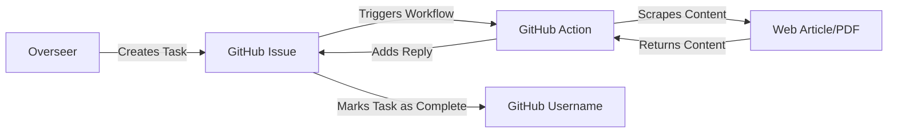

**Prompt:**
Begin writing code and unit tests. Use click for the tui. use gh cli or python library where possible. And apply sensible abstractions where beneficial. For tasks, you need to parse the gh body for markdown for open tasks. It should be able to add tasks in a new gh issue using markdown.
## System Design Outline



## Associated Tasks for Development

1. **Task 1:** Set up a private GitHub repo and configure GitHub Actions.
2. **Task 2:** Design and implement the Text User Interface (TUI) for the overseer. This includes functions for browsing issues, adding new tasks, and replying to queries.
3. **Task 3:** Implement the functionality to create new tasks as GitHub issues from the TUI, following a set task format and labeling them as inbox-url.
Here is an example use case it needs to support:
## System Design Outline


## Associated Tasks for Development

1. **Task 1:** Set up a private GitHub repo and configure GitHub Actions.
2. **Task 2:** Design and implement the Text User Interface (TUI) for the overseer. This includes functions for browsing issues, adding new tasks, and replying to queries.
3. **Task 3:** Implement the functionality to create new tasks as GitHub issues from the TUI, following a set task format and labeling them as inbox-url.

**Response:**
Here is a basic Python code using the `click` library for the Text User Interface (TUI) and the `github` library to interact with GitHub. This code is a starting point and does not cover all the tasks mentioned above.

```python
import click
from github import Github

# First create a Github instance using an access token
g = Github("<access_token>")

# Then play with your Github objects
for repo in g.get_user().get_repos():
    print(repo.name)

@click.group()
def cli():
    pass

@cli.command()
@click.argument('issue_title')
@click.argument('issue_body')
def create_issue(issue_title, issue_body):
    """Create a new GitHub issue."""
    repo = g.get_user().get_repo("<repo_name>")
    issue = repo.create_issue(
        title=issue_title,
        body=issue_body,
        labels=[
            repo.get_label("inbox-url")
        ]
    )
    click.echo(f"Issue '{issue_title}' created with ID {issue.id}")

@cli.command()
@click.argument('issue_id')
def close_issue(issue_id):
    """Close a GitHub issue."""
    repo = g.get_user().get_repo("<repo_name>")
    issue = repo.get_issue(int(issue_id))
    issue.edit(state="closed")
    click.echo(f"Issue '{issue.title}' closed")

if __name__ == '__main__':
    cli()
```

To run the above script, you need to replace `<access_token>` with your GitHub access token and `<repo_name>` with the name of your repository. You can run the script using the following commands:

```bash
python script.py create_issue "Issue Title" "Issue Body"
python script.py close_issue 1
```

The first command will create a new issue with the title "Issue Title" and the body "Issue Body". The second command will close the issue with ID 1.

For the unit tests, you can use the `unittest` library in Python. Here is an example of how you can write unit tests for the above script:

```python
import unittest
from unittest.mock import patch, MagicMock
from script import create_issue, close_issue

class TestScript(unittest.TestCase):

    @patch('script.Github')
    @patch('script.click')
    def test_create_issue(self, mock_click, mock_github):
        mock_repo = MagicMock()
        mock_github.return_value.get_user.return_value.get_repo.return_value = mock_repo
        mock_issue = MagicMock()
        mock_issue.id = 1
        mock_issue.title = "Issue Title"
        mock_repo.create_issue.return_value = mock_issue

        create_issue("Issue Title", "Issue Body")

        mock_repo.create_issue.assert_called_once_with(
            title="Issue Title",
            body="Issue Body",
            labels=[
                mock_repo.get_label("inbox-url")
            ]
        )
        mock_click.echo.assert_called_once_with("Issue 'Issue Title' created with ID 1")

    @patch('script.Github')
    @patch('script.click')
    def test_close_issue(self, mock_click, mock_github):
        mock_repo = MagicMock()
        mock_github.return_value.get_user.return_value.get_repo.return_value = mock_repo
        mock_issue = MagicMock()
        mock_issue.title = "Issue Title"
        mock_repo.get_issue.return_value = mock_issue

        close_issue("1")

        mock_repo.get_issue.assert_called_once_with(1)
        mock_issue.edit.assert_called_once_with(state="closed")
        mock_click.echo.assert_called_once_with("Issue 'Issue Title' closed")

if __name__ == '__main__':
    unittest.main()
```

This script will test the `create_issue` and `close_issue` functions. It uses the `unittest.mock` library to mock the `Github` and `click` libraries.

<details><summary>Metadata</summary>

- Duration: 94699 ms
- Datetime: 2023-10-31T18:09:05.486920
- Model: gpt-4-0613

</details>

**Options:**
```json
{"temperature": 0.2}
```

