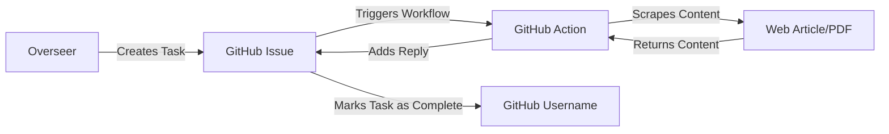

**Prompt:**
Begin writing code. use bash and gh cli where possible for the tui. For tasks, you need to parse the gh body for markdown for open tasks. It should be able to add tasks in a new gh issue using markdown.
## System Design Outline



## Associated Tasks for Development

1. **Task 1:** Set up a private GitHub repo and configure GitHub Actions.
2. **Task 2:** Design and implement the Text User Interface (TUI) for the overseer. This includes functions for browsing issues, adding new tasks, and replying to queries.
3. **Task 3:** Implement the functionality to create new tasks as GitHub issues from the TUI, following a set task format and labeling them as inbox-url.


Here is an example use case it needs to support:
1. **On GitHub Workflow:** Set up a new workflow that triggers on issue creation and label being assigned as 'inbox-url'. Below is a personalized example of how your GitHub workflow `.yml` might look like:


```yml
name: Task Processing

on:
  issues:
    types: [opened, labeled]

jobs:
  process_task:
    if: github.event.label.name == 'inbox-url'
    runs-on: ubuntu-latest
    steps:
      - name: Checkout
        uses: actions/checkout@v2

      - name: Setup Node.js
        uses: actions/setup-node@v2
        with:
          node-version: '14'

      - name: Install dependencies
        run: | 
          npm ci
          npm install axios pdf-parse 

      - name: Run task processing script
        run: node .github/actions/process.js
        env:
          GITHUB_TOKEN: ${{ secrets.GITHUB_TOKEN }}

      - name: Assign to owner
        uses: peter-evans/create-or-update-comment@v1
        with:
          token: ${{ secrets.GITHUB_TOKEN }}
          issue-number: "${{ github.event.issue.number }}"
          assignees: <Your UserName>
```


2. **Node.js Serverless Function:** 

In this script, you make use of the GitHub Octokit client to make changes to issues, Axios for sending web request to get URL contents, and pdf-parse to parse PDFs from URLs when needed. Note: Make sure to replace `'owner/repo'` placeholder with your repository and `'GITHUB_PAT'` placeholder with your GitHub Personal Access Token.


```javascript
const axios = require('axios');
const pdf = require('pdf-parse');
const core = require('@actions/core');
const github = require('@actions/github');
const { readFile } = require('fs').promises;

process()
  .then(() => core.info('Completed task processing'))
  .catch(error => core.setFailed(error.message));

async function process() {
  const repoToken = process.env.GITHUB_TOKEN;
  const context = github.context;
  const octokit = github.getOctokit(repoToken);

  const { number } = context.issue;
  const { body } = context.payload.issue;

  let url;
  let issueText = body
    .split('\n')
    .filter(line => {
      if (line.startsWith("- [ ]")) {
        url = line.match(/\[.*?\]\((.*?)\)/)[1];
        return false;
      }
      return true;
    })
    .join('\n');

  let text;
  if (url.endsWith('.pdf')) {
    const { data } = await axios.get(url, { responseType: 'arraybuffer' });
    text = await pdf(data);
  } else {
    const { data } = await axios.get(url);
    text = extractTextFromHTML(data);
  }

  issueText += '\n\n' + text;

  await octokit.rest.issues.update({
    owner: context.owner.login,
    repo: context.repo.repo,
    issue_number: number,
    body: issueText
  });

  await octokit.rest.issues.addAssignees({
    owner: context.owner.login,
    repo: context.repo.repo,
    issue_number: number,
    assignees: [context.owner.login]
  });
}

function extractTextFromHTML(html) {
  // Add logic to extract text from HTML. This depends largely on the structure of the scraped web pages.
}
```

**Response:**
3. **Text User Interface (TUI):** 

The TUI will be a simple bash script that interacts with the GitHub CLI (gh cli) to create new tasks. The script will prompt the user for the task details, format them into a markdown task list, and create a new issue with the task list in the body.

Here is a basic example of how the bash script might look like:

```bash
#!/bin/bash

# Prompt for task details
echo "Enter task title:"
read title
echo "Enter task description:"
read description
echo "Enter task URL:"
read url

# Format task list
task_list="- [ ] [${description}](${url})"

# Create new issue
gh issue create --title "$title" --body "$task_list" --label "inbox-url"
```

To run the script, you would simply call it from the command line:

```bash
bash create_task.sh
```

This script will prompt you to enter the task title, description, and URL. It will then format these details into a markdown task list and create a new issue with the task list in the body. The issue will be labeled with "inbox-url", which will trigger the GitHub Action to process the task.

Please note that you need to have the GitHub CLI installed and authenticated with your GitHub account to use this script.

<details><summary>Metadata</summary>

- Duration: 28263 ms
- Datetime: 2023-10-31T18:24:07.894092
- Model: gpt-4-0613

</details>

**Options:**
```json
{"temperature": 0.2}
```

